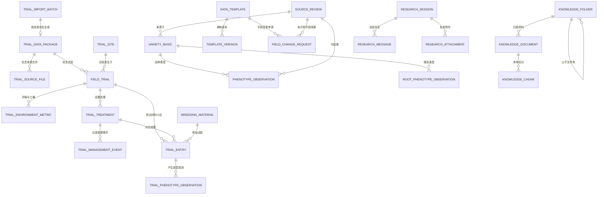

# 水稻数据治理与农业科研助手数据库表结构介绍

**版本：v1.3.0**  
**适用范围：本地 Demo 当前 PostgreSQL 数据库 `rice_demo`**  
**更新时间：2026-07-21**

## 1. 这套数据库解决什么问题

平台不是把所有 Excel 内容塞进一张大表，而是按数据的真实业务含义分层保存：

1. **品种级标准数据**：适合管理公开品种资料、单品种表型字段和基础检索。
2. **试验级标准数据**：适合保存“一个材料在一次试验、一个处理、一个重复和一个小区中的观测值”，用于严谨的同试验比较、多年多点稳定性、环境和管理影响分析。
3. **数据治理数据**：记录来源文件、标准模板、规则版本、字段变更请求和审核状态。
4. **知识库与助手数据**：保存公共/私有资料的目录、解析分段、向量，以及科研人员各自隔离的会话和附件。

原始 ZIP、原始 Excel、论文和私有附件的二进制文件不直接塞入 PostgreSQL：它们保存在本地对象/文件存储中；数据库仅保存文件路径、哈希、解析结果、来源定位和业务关系。这样便于保留原件、控制访问、避免数据库膨胀。

## 2. 总体关系图

## 3. 关键设计原则

### 3.1 两种表型数据不能混为一谈

| 数据结构 | 最小单元 | 用途 | 能否严谨支持环境/管理分析 |
|---|---|---|---|
| `phenotype_observation` | 某品种的一项表型值 | 国家水稻数据中心网页、单份品种资料、基础检索与对比 | 不能。多数记录缺少统一试验、处理、重复和环境上下文。 |
| `trial_phenotype_observation` | 某材料在某试验、某处理、某重复、某小区的一项表型值 | 三年多点区域试验、品系比较、环境影响和稳定性分析 | 可以。这是 v1.3.0 重点使用的结构。 |

因此，不能将“某品种的一个株高”当作可直接跨环境比较的证据；必须知道它在哪个试验、什么施肥处理、哪个重复和小区中得到。

### 3.2 主键与业务编码分工

- 所有实体表均以 `id`（UUID 风格字符串）作为技术主键，用于外键关联，名称变更不会破坏关联。
- 同时保留科研人员可识别的业务编码，如 `material_code`、`trial_code`、`site_code`、`package_code`。
- 已建立唯一约束的关键编码包括：材料编码、试验编码、试验点编码、资料包编码。
- `trial_entry` 还以 `trial_id + treatment_id + material_id + replicate_no + block_no + plot_no` 做唯一约束，避免同一小区被重复入库。
- `trial_phenotype_observation` 以 `entry_id + trait_code + observation_stage` 做唯一约束，避免同一小区同一时期同一性状重复写入。

## 4. 数据治理与标准模板表

### 4.1 `source_review`：原始来源与审核记录

| 项目 | 说明 |
|---|---|
| 主键 | `id` |
| 核心字段 | `source_type`、`source_name`、`source_url`、`file_path`、`file_hash`、`raw_text`、`page_or_locator`、`parsing_status`、`quality_status`、`review_history`、`template_version_id` |
| 连接方式 | 被 `variety_basic.source_review_id`、`phenotype_observation.source_review_id`、`root_phenotype_observation.source_review_id`、`field_change_request.source_review_id` 引用。 |
| 主要功能 | 保存网页、HTML、PDF、Excel 等原始来源的定位、文件哈希、解析文本与审核历史。任何字段都能回到原文件、网页地址、页码或单元格位置核查。 |

### 4.2 `data_template`：数据标准模板主表

| 项目 | 说明 |
|---|---|
| 主键 | `id` |
| 核心字段 | `template_code`、`template_name`、`data_scope`、`target_table`、`description`、`current_version_id`、`status` |
| 连接方式 | 逻辑上与 `template_version.template_id` 一对多；与 `field_change_request.template_id` 一对多。`current_version_id` 指向当前启用版本。 |
| 主要功能 | 定义一套“数据应写入哪个目标表、适用什么业务范围”的标准，例如国家水稻数据中心信息标准、水稻根系表型数据标准。 |

### 4.3 `template_version`：模板字段版本表

| 项目 | 说明 |
|---|---|
| 主键 | `id` |
| 外键 | `template_id -> data_template.id` |
| 核心字段 | `version`、`change_summary`、`field_definitions`、`status`、`created_by`、`created_at` |
| 主要功能 | 将字段定义、单位、别名、是否必填、目标表字段等保存成版本化 JSON。发布过的版本不覆盖修改，新增字段时形成新版本，保证历史数据仍可解释。 |

### 4.4 `data_rule`：质量检查与字段映射规则

| 项目 | 说明 |
|---|---|
| 主键 | `id` |
| 核心字段 | `rule_code`、`rule_name`、`rule_type`、`version`、`severity`、`config`、`status`、`change_reason`、`created_by` |
| 连接方式 | 当前通过规则版本号写入 `phenotype_observation.rule_version` 等记录；不直接绑定某一条表型记录。 |
| 主要功能 | 维护字段映射、单位换算、质量校验和业务映射规则。例如把“千粒质量”映射为“千粒重”，把 `kg/ha` 换算为 `kg/亩`，或对结实率超出 0–100% 进行阻断。 |

### 4.5 `field_change_request`：未知字段/模板变更申请

| 项目 | 说明 |
|---|---|
| 主键 | `id` |
| 外键 | `source_review_id -> source_review.id`；`template_id -> data_template.id` |
| 核心字段 | `source_field`、`sample_value`、`request_note`、`status`、`submitted_by`、`resolved_by`、`resolution_note`、`resolved_version_id` |
| 主要功能 | 数据处理员遇到无法识别字段、单位不清或现有模板不覆盖的内容时提交申请；字段管理员确认后新增/修订模板版本，并留下决策原因。 |

## 5. 品种级基础数据表

这部分面向“已公开或单份资料中抽取的品种信息”。它便于检索，但缺少严谨的试验设计信息，不能替代第 6 节的区域试验数据。

### 5.1 `variety_basic`：品种基础信息表

| 项目 | 说明 |
|---|---|
| 主键 | `id` |
| 外键 | `source_review_id -> source_review.id` |
| 核心字段 | `variety_name`、`normalized_name`、`alias_names`、`raw_variety_title`、`variety_type`、`female_parent`、`male_parent`、`breeding_unit`、`approval_number`、`approval_year`、`suitable_region`、`data_status` |
| 连接方式 | 一条品种可对应多条 `phenotype_observation` 和 `root_phenotype_observation`；通过 `source_review_id` 追溯原网页、文件或人工补录来源。 |
| 主要功能 | 解决品种名称、别名、审定编号、亲本、适种区等基础信息分散的问题，作为品种级表型检索的主体。 |

### 5.2 `phenotype_observation`：地上部与品质表型长表

| 项目 | 说明 |
|---|---|
| 主键 | `id` |
| 外键 | `variety_id -> variety_basic.id`；可选 `source_review_id -> source_review.id` |
| 核心字段 | `trait_code`、`trait_name`、`trait_category`、`observation_type`、`value_numeric`、`value_min`、`value_max`、`value_text`、`unit`、`original_value`、`original_field`、`source_locator`、`trial_year`、`trial_location`、`evaluation_method`、`rule_version`、`quality_status`、`publish_status` |
| 连接方式 | 多条表型记录属于一个 `variety_basic`；每条记录可以回溯一个 `source_review`。 |
| 主要功能 | 用长表保存株高、千粒重、结实率、产量、米质、苗瘟/叶瘟/穗瘟等不同字段。标准字段新增时无需改表结构；只需增加新的 `trait_code`。 |
| 注意 | `trial_year`、`trial_location` 为可选来源描述，不能替代标准化的试验、处理、重复、小区结构。 |

### 5.3 `root_phenotype_observation`：根系表型长表

| 项目 | 说明 |
|---|---|
| 主键 | `id` |
| 外键 | `variety_id -> variety_basic.id`；可选 `source_review_id -> source_review.id` |
| 核心字段 | `trait_code`、`trait_name`、`trait_category`、`value_numeric`、`value_text`、`unit`、`original_value`、`original_field`、`source_locator`、`template_version`、`published_at` |
| 连接方式 | 与 `variety_basic` 按品种关联；来源由 `source_review` 追溯。 |
| 主要功能 | 独立保存根长、总根长、根数、根表面积、根体积、平均根径、根尖数、根干重、根系角度、根冠比等根系性状，避免与地上部字段混放。 |

## 6. 区域试验资料包与试验级标准数据表

这是本次区域试验数据治理闭环的核心。它能支持同试验比较、多年多点稳定性、环境关联、管理影响、性状权衡和表现变差证据拆解。

### 6.1 `trial_import_batch`：原始资料包暂存批次

| 项目 | 说明 |
|---|---|
| 主键 | `id` |
| 外键 | 可选 `published_package_id -> trial_data_package.id` |
| 核心字段 | `display_name`、`archive_name`、`archive_path`、`archive_sha256`、`uploaded_by`、`parse_status`、`parse_summary`、`parsed_payload`、`warnings`、`error_message`、`parsed_at`、`published_at` |
| 主要功能 | 接收数据处理员上传的 ZIP，保存原始文件路径和 SHA-256，保留解析后的临时载荷、字段换算提示和错误。状态为 `ready_for_review` 前不得进入科研查询。 |
| 连接方式 | 数据处理员确认发布后，生成一个 `trial_data_package`，并将其 ID 回写到 `published_package_id`。 |

### 6.2 `trial_data_package`：已发布区域试验数据包

| 项目 | 说明 |
|---|---|
| 主键 | `id`；业务唯一键 `package_code` |
| 核心字段 | `package_name`、`dataset_type`、`governance_status`、`description`、`is_simulated`、`created_at` |
| 连接方式 | 一对多连接 `field_trial`、`trial_source_file`、`trial_analysis_run`；由 `trial_import_batch.published_package_id` 反向指向。 |
| 主要功能 | 表示一套已审核、可被科研助手读取的区域试验标准数据。`governance_status='published'` 是助手读取数据的前提。 |

### 6.3 `trial_source_file`：资料包内来源文件目录

| 项目 | 说明 |
|---|---|
| 主键 | `id`；唯一约束 `package_id + file_name` |
| 外键 | `package_id -> trial_data_package.id` |
| 核心字段 | `file_name`、`source_role`、`source_format`、`relative_path`、`raw_schema_note`、`processing_status`、`checksum` |
| 主要功能 | 记录 ZIP 内每个 Excel 的角色，例如材料布局、环境土壤、管理记录、农艺品质；用于回答时回溯“某条数据来自哪个文件”。 |

### 6.4 `breeding_material`：育种材料主数据

| 项目 | 说明 |
|---|---|
| 主键 | `id`；业务唯一键 `material_code` |
| 核心字段 | `material_name`、`material_type`、`is_check`、`aliases`、`pedigree_summary` |
| 连接方式 | 通过 `trial_entry.material_id` 与具体试验小区关联。 |
| 主要功能 | 将候选材料、对照品种、恢复系等统一成可跨年跨点识别的实体；`aliases` 保留不同年份表格中的材料别名。 |

### 6.5 `trial_site`：试验点主数据

| 项目 | 说明 |
|---|---|
| 主键 | `id`；业务唯一键 `site_code` |
| 核心字段 | `site_name`、`province`、`county`、`ecological_zone`、`soil_type`、`latitude`、`longitude` |
| 连接方式 | 一个试验点对应多条 `field_trial`。 |
| 主要功能 | 固化试验地点与生态区，支持“同一材料在不同生态区表现差异”及地点筛选。 |

### 6.6 `field_trial`：试验基础表

| 项目 | 说明 |
|---|---|
| 主键 | `id`；业务唯一键 `trial_code` |
| 外键 | `package_id -> trial_data_package.id`；`site_id -> trial_site.id` |
| 核心字段 | `trial_year`、`trial_name`、`crop_name`、`experiment_type`、`design_type`、`replicate_count`、`data_status`、`source_note` |
| 连接方式 | 一个试验向下连接环境指标、处理、参试记录；向上连接资料包和试验点。 |
| 主要功能 | 表示“2025 年南昌点某区域试验”这一共同实验背景，不直接存每个材料的表型。它是同试验比较的共同锚点。 |

### 6.7 `trial_environment_metric`：环境与土壤指标长表

| 项目 | 说明 |
|---|---|
| 主键 | `id`；唯一约束 `trial_id + metric_code` |
| 外键 | `trial_id -> field_trial.id` |
| 核心字段 | `metric_code`、`metric_name`、`value_numeric`、`unit`、`original_value`、`collection_method`、`source_locator` |
| 主要功能 | 存储试验共同环境，例如土壤 pH、有效磷、有效钾、有机质、降雨量、平均气温、病害压力。长表设计便于以后加入新环境字段。 |
| 可实现功能 | 将环境指标同该 `trial_id` 下材料的平均产量、结实率、千粒重关联，做样本相关分析。 |

### 6.8 `trial_treatment`：试验处理表

| 项目 | 说明 |
|---|---|
| 主键 | `id`；唯一约束 `trial_id + treatment_code` |
| 外键 | `trial_id -> field_trial.id` |
| 核心字段 | `treatment_code`、`treatment_name`、`treatment_description` |
| 主要功能 | 保存标准施氮、较高施氮、密度处理、灌溉处理等处理组。一个试验可有多个处理；同一材料在不同处理下通过该表区分。 |

### 6.9 `trial_management_event`：栽培管理事件表

| 项目 | 说明 |
|---|---|
| 主键 | `id` |
| 外键 | `treatment_id -> trial_treatment.id` |
| 核心字段 | `event_type`、`input_name`、`rate_per_mu`、`unit`、`event_stage`、`notes` |
| 主要功能 | 记录施氮量、肥料名称、追肥时期、播插密度、灌溉等具体管理动作。它比 `trial_treatment` 更细，可解释“高氮处理到底高在哪里”。 |
| 可实现功能 | 以同试验、同材料为配对条件，比较 `M1` 与 `M2` 下产量、株高和倒伏评分的观测差。 |

### 6.10 `trial_entry`：材料参试与小区记录表

| 项目 | 说明 |
|---|---|
| 主键 | `id`；唯一约束 `trial_id + treatment_id + material_id + replicate_no + block_no + plot_no` |
| 外键 | `trial_id -> field_trial.id`；`treatment_id -> trial_treatment.id`；`material_id -> breeding_material.id` |
| 核心字段 | `replicate_no`、`block_no`、`plot_no`、`raw_material_name`、`source_locator` |
| 主要功能 | 是整个试验级模型的最小实验单位：**一个材料在一次试验、一个处理、一个重复、一个区组和一个小区中参试**。 |
| 可实现功能 | 为所有表型建立严谨上下文。平台能据此知道两个株高值能否比较，且可回到原 Excel 的对应行。 |

### 6.11 `trial_phenotype_observation`：试验级表型观测长表

| 项目 | 说明 |
|---|---|
| 主键 | `id`；唯一约束 `entry_id + trait_code + observation_stage` |
| 外键 | `entry_id -> trial_entry.id` |
| 核心字段 | `trait_code`、`trait_name`、`trait_category`、`value_numeric`、`value_text`、`unit`、`original_value`、`observation_stage`、`evaluation_method`、`source_locator`、`quality_status`、`publish_status` |
| 主要功能 | 以长表存储每小区的产量、株高、结实率、千粒重、整精米率、垩白度、倒伏评分、穗瘟评分等；保留标准值和原始值。 |
| 可实现功能 | 通过 `entry_id` 向上关联材料、试验、处理、重复、小区、环境和管理。它是科研助手六类区域试验问题的直接数据来源。 |

### 6.12 `v_trial_material_summary`：试验材料汇总视图

| 类型 | PostgreSQL 视图，不是原始写入表 |
|---|---|
| 来源 | 联接 `field_trial`、`trial_site`、`trial_treatment`、`trial_entry`、`breeding_material` 和 `trial_phenotype_observation` 后按材料汇总。 |
| 输出 | 年份、地点、生态区、处理、材料、是否对照、重复数、平均产量、株高、千粒重、结实率、整精米率、垩白度、穗瘟和倒伏评分。 |
| 主要功能 | 为科研助手提供受控、可读、无需动态拼写 SQL 的分析数据源；用于同试验比较、稳定性、性状权衡等问题。 |

### 6.13 `trial_analysis_run`：区域试验分析结果留存表

| 项目 | 说明 |
|---|---|
| 主键 | `id` |
| 外键 | `package_id -> trial_data_package.id`，删除资料包时级联删除。 |
| 核心字段 | `analysis_type`、`analysis_version`、`result_json`、`limitation_note`、`created_at` |
| 主要功能 | 为后续保存正式分析任务、报告生成参数、分析算法版本和结果快照预留。目前科研助手可即时计算，后续可将用户确认保存的报告写入此表。 |

## 7. 知识库表

### 7.1 `knowledge_folder`：公共/私有知识库文件夹

| 项目 | 说明 |
|---|---|
| 主键 | `id` |
| 外键 | `parent_id -> knowledge_folder.id`，删除父文件夹时级联删除子文件夹。 |
| 核心字段 | `scope`、`owner_id`、`folder_name`、`description`、`created_by`、`created_at`、`updated_at` |
| 主要功能 | 实现公共知识库分类和科研人员“我的知识库”文件夹。`scope` 区分公共与私有，`owner_id` 标识私有目录归属。 |

### 7.2 `knowledge_document`：知识库资料元数据表

| 项目 | 说明 |
|---|---|
| 主键 | `id` |
| 外键 | 可选 `folder_id -> knowledge_folder.id`，删除文件夹时将资料移为未分类。 |
| 核心字段 | `scope`、`owner_id`、`original_file_name`、`display_title`、`content_type`、`size_bytes`、`content_hash`、`storage_path`、`source_organization`、`author`、`publication_year`、`source_url`、`short_description`、`parsing_status`、`indexing_status`、`parser_name`、`parser_warnings`、`status`、`version_number`、`supersedes_document_id`、`version_change_summary` |
| 主要功能 | 保存资料目录、文件存储地址、解析和索引状态、文献来源信息，以及资料版本关系。系统不开放原文下载，只供本地检索和助手引用。 |

### 7.3 `knowledge_chunk`：知识库分段与向量表

| 项目 | 说明 |
|---|---|
| 主键 | `id` |
| 外键 | `document_id -> knowledge_document.id`，删除资料时级联删除分段。 |
| 核心字段 | `scope`、`owner_id`、`folder_id`、`document_status`、`ordinal`、`content`、`source_locator`、`embedding`、`created_at` |
| 主要功能 | 保存 Docling/MinerU 解析后切分的段落和 `pgvector` 向量。检索时先按公共/私有范围及所有者过滤，再做语义相似度搜索，返回“具体文档 + 页码/段落”的证据。 |

## 8. 农业科研助手会话与私有附件表

### 8.1 `research_session`：科研人员会话表

| 项目 | 说明 |
|---|---|
| 主键 | `id` |
| 核心字段 | `owner_id`、`title`、`memory_summary`、`memory_state`、`created_at`、`updated_at` |
| 主要功能 | 保存每位科研人员的对话标题与压缩上下文。`owner_id` 是会话隔离的核心字段。 |

### 8.2 `research_message`：会话消息与证据表

| 项目 | 说明 |
|---|---|
| 主键 | `id` |
| 外键 | `session_id -> research_session.id`，删除会话时级联删除。 |
| 核心字段 | `owner_id`、`role`、`content`、`evidence`、`operation_state`、`created_at` |
| 主要功能 | 保存用户提问、模型回答、证据卡片和工具执行状态。`evidence` 可记录已发布数据、附件、知识库片段和联网参考的实际引用项。 |

### 8.3 `research_attachment`：会话私有附件表

| 项目 | 说明 |
|---|---|
| 主键 | `id` |
| 外键 | `session_id -> research_session.id`，删除会话时级联删除。 |
| 核心字段 | `owner_id`、`file_name`、`content_type`、`size_bytes`、`storage_path`、`parser_name`、`parsing_status`、`parsed_markdown`、`parsed_metadata`、`parser_warnings`、`created_at` |
| 主要功能 | 保存当前会话上传的 PDF、Office、表格、文本或图片元数据和本地解析结果。附件原件保存在本地文件存储；图片可按需原图发送到多模态模型。 |

### 8.4 `research_audit`：科研助手审计日志

| 项目 | 说明 |
|---|---|
| 主键 | `id` |
| 逻辑关联 | `owner_id` 对应科研人员；`session_id` 对应会话（当前为逻辑关联，未设置数据库外键）。 |
| 核心字段 | `action`、`metadata`、`created_at` |
| 主要功能 | 记录会话创建、附件上传/删除、模型调用、导出等关键操作，便于审计与问题排查。 |

## 9. 主要查询如何跨表实现

| 科研问题 | 主要连接路径 | 得到的结果 |
|---|---|---|
| 同一试验、同处理下哪些材料高产且株高低 | `field_trial -> trial_treatment -> trial_entry -> trial_phenotype_observation -> breeding_material` | 在相同年份、地点、处理、试验设计背景下比较材料平均值。 |
| 某材料多年多点稳定性 | `breeding_material -> trial_entry -> field_trial -> trial_phenotype_observation` | 按材料汇总多个年点的平均产量、相对对照增产、标准差、变异系数和有效环境数。 |
| 土壤/天气同表型的关联 | `field_trial -> trial_environment_metric` 与 `field_trial -> trial_entry -> trial_phenotype_observation` | 在每个试验环境中汇总材料表现，再描述 pH、有效磷、降雨量与产量、结实率、千粒重的关联。 |
| 标准施氮和高施氮影响 | 同一 `field_trial` 中，以 `material_id` 配对 `trial_treatment(M1/M2)` 下的 `trial_entry` 与观测值；管理细节由 `trial_management_event` 补充 | 得到同材料同年点下的增产、株高和倒伏评分差值。 |
| 高产与米质/抗倒伏是否存在取舍 | `trial_entry -> trial_phenotype_observation`，同一处理下按材料跨环境汇总 | 比较产量、整精米率、垩白度、倒伏评分并计算描述性相关。 |
| 某材料表现变差的证据拆解 | 某 `material_id` 的多个 `field_trial`，同时读取环境、处理、管理和表型观测 | 并列展示年份、地点、土壤、天气、病害压力、施氮、结实率、千粒重和产量变化；只提供证据，不把相关直接说成因果。 |

## 10. 当前边界与后续扩展建议

1. 当前区域试验导入器面向水稻三年多点 Excel 资料包，已覆盖布局、环境、管理、农艺/品质四类表；基因型、分子标记、病害图片和遥感数据尚未进入这一版自动入库。
2. 同一资料包内的材料采用 `material_code` 统一；真实农科院数据若缺少稳定材料编码，应先在导入核验阶段建立别名映射并由数据处理员确认。
3. 当前科研助手优先读取最新的已发布区域试验资料包，适合本次 Demo 的单课题组资料展示。正式版可增加“选择资料包/课题/试验组”的查询范围控件，并支持跨资料包汇总。
4. 环境、管理和性状权衡分析目前是可追溯的描述性统计与配对比较；若要发表或形成育种决策，应进一步引入混合线性模型、GGE/AMMI、显著性检验和专家审阅流程。
5. `trial_analysis_run` 已为正式报告、算法版本和结果快照预留；后续生成 PDF 报告时应写入运行参数、数据范围、算法版本与证据列表。

## 11. 一句话总结

`variety_basic + phenotype_observation` 用于管理“品种有什么已知资料”；  
`field_trial + trial_entry + trial_phenotype_observation` 用于回答“材料为什么在不同试验中表现不同”；  
`source_review / trial_source_file` 用于回答“这个结论来自哪里”；  
`knowledge_* + research_*` 用于让科研人员在权限隔离下把资料、检索证据和对话沉淀为可复用的科研辅助能力。
